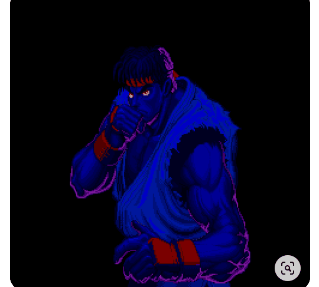

# Projeto com README
Um projeto com arquivo README 🚀

[](https://br.pinterest.com/pin/626985579344972676/)


## Tecnologias utilizadas
- HTML
- CSS
- JS
- Hadouken

### Como utilizar 

1 - Clone para o projeto 

``` 
git clone

```
2 - Acesse a pasta do projeto 
```
cd repositorio-com-readme
```